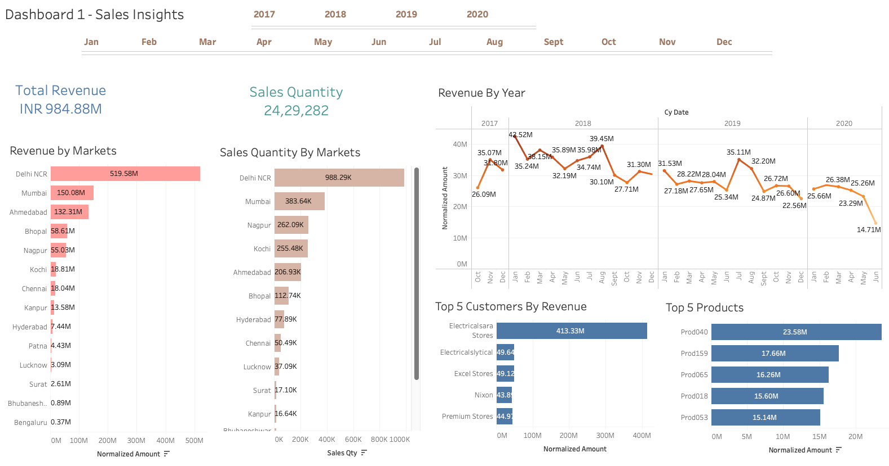
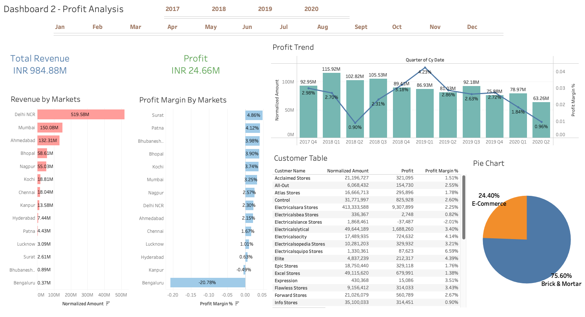
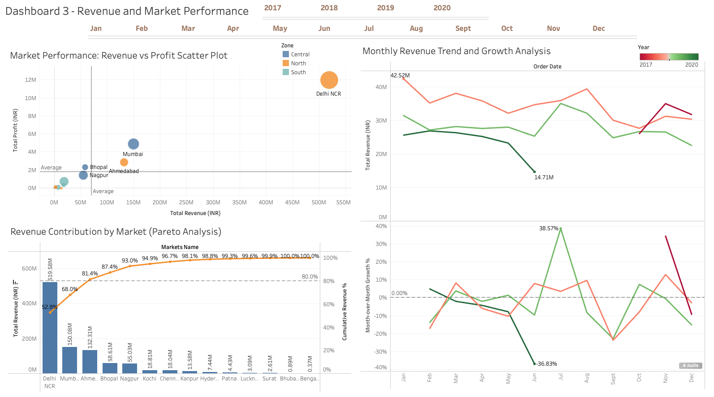

# Sales Insights Data Analysis (Tableau Project)

## 1. Project Overview

This project analyzes sales and market performance for a computer hardware business operating in a dynamically changing market environment. The company experienced declining sales and lacked a clear understanding of where the business was underperforming. Management relied heavily on spreadsheets, which made it difficult to generate actionable insights from the data. 

The goal of this project is to transform raw transactional data into interactive business intelligence dashboards using SQL for data exploration and Tableau for advanced visualization. The dashboards provide clear insights into revenue performance, market contribution, profitability trends, and sales growth patterns.

Three interactive dashboards were developed to progressively explore the business performance:

1. Sales Insights Dashboard – Basic sales performance overview
2. Profit Analysis Dashboard – Profitability analysis based on stakeholder feedback
3. Revenue & Market Performance Dashboard – Advanced analytical visualizations

Together, these dashboards enable stakeholders to quickly identify high-performing markets, understand revenue concentration, track sales trends, and detect opportunities for business growth.

---

## 2. Project Highlights

- Built 3 interactive Tableau dashboards for comprehensive sales analysis
- Performed SQL data exploration on a relational database
- Implemented data cleaning and transformation in Tableau
- Normalized currency values to maintain consistent revenue reporting
- Created advanced visualizations including:
    - Pareto Analysis (80/20 Rule)
    - Revenue vs Profit Scatter Plot 
    - Monthly Revenue Trend with Growth Analysis
- Provided data-driven business recommendations

---

## 3. Key Skills Demonstrated

- Data Visualization using Tableau
- SQL Data Exploration and Querying
- Business Intelligence Dashboard Design
- Data Cleaning and Transformation
- Revenue Trend Analysis
- Profitability Analysis
- Pareto Analysis (80/20 Principle)
- Market Performance Analysis
- Dashboard Storytelling

---

## 4. Business Problem

The hardware company faced several operational challenges:
- Sales were declining across several markets
- Management lacked visibility into which markets and customers were driving revenue
- Spreadsheets made it difficult to analyze large volumes of data
- There were no centralized dashboards or analytics tools
- Decision-making relied on manual reporting rather than data insights

As a result, the business required a data-driven solution to understand:
- Which markets generate the most revenue
- Which customers and products contribute the most to sales
- How revenue trends change over time
- Which markets are profitable
- Where growth opportunities exist

---

## 5. Project Objectives

The main objective of this project is to build an analytics solution that provides simple and actionable insights for business stakeholders.

Key analytical questions addressed:

- Revenue breakdown by city (market)
- Revenue performance across years and months
- Identification of Top 5 customers by revenue
- Identification of Top 5 products by revenue
- Market-level profitability comparison
- Revenue concentration across markets
- Monthly sales trends and growth patterns

---

## 6. Dataset Information & Credit
### 6.1 Data Source

The dataset used in this project was provided as part of the course **Learn Tableau Data Analysis Project: Sales Insights**, conducted by **Codebasics**.

Full credit goes to the **Mr. Dhaval Patel** and the Codebasics team for providing the dataset and learning resources.

> **Note:** The dataset used in this project is not included in this GitHub repository due to sharing restrictions.

The original dataset was stored in a **MySQL relational database** containing transactional sales data. Due to connection limitations in the local environment, the data was exported from MySQL into **Excel files**, which were then used in **Tableau for data modeling and visualization.**

This project has been developed strictly for **educational and portfolio demonstration purposes.**

### 6.2 Database Structure

The dataset consists of five tables.

- Transactions (Fact Table)
- Customers (Dimension Table)
- Markets (Dimension Table)
- Products (Dimension Table)
- Date (Dimension Table)

---

## 7. Tools & Technologies Used

| Tool         | Purpose                                        |
|--------------|------------------------------------------------|
| MySQL        | Data exploration and querying                  |
| MySQL        | Workbench	SQL execution environment            |
| Excel        | Data export and preprocessing                  |
| Tableau      | Data visualization and dashboard development   |

---

## 8. Project Structure & Workflow
### 8.1 Data Exploration Using SQL

Initial exploration was performed in MySQL Workbench to understand the dataset and verify data quality.

Example SQL Queries:

**Retrieve all customers**

    SELECT * FROM customers;

**Count total customers**

    SELECT COUNT(*) FROM customers;

**Retrieve all products**

    SELECT * FROM products;

**Total number of products**

    SELECT COUNT(*) FROM products;

**Retrieve all markets**

    SELECT * FROM markets;

**Total number of markets**

    SELECT COUNT(*) FROM markets;

**Retrieve all transactions**

    SELECT * FROM transactions;

**First 5 transaction records**

    SELECT * FROM transactions LIMIT 5;

**Transactions for Mumbai market (market code for mumbai is Mark002)**

    SELECT * FROM transactions WHERE market_code = "Mark002";

**Count transactions in Chennai market (market code for chennai is Mark001)**

    SELECT COUNT(*) FROM transactions WHERE market_code ="Mark001";

**Transactions with USD currency**

    SELECT * FROM transactions WHERE currency = 'USD';

**Join transactions with date table**

    SELECT transactions.*, date.* FROM transactions INNER JOIN date ON transactions.order_date=date.date;

**Total revenue in 2019**

    SELECT SUM(transactions.sales_amount) FROM transactions INNER JOIN date ON transactions.order_date=date.date WHERE date.year=2019;

**Total revenue in 2020, March Month**

    SELECT SUM(transactions.sales_amount) FROM transactions INNER JOIN date ON transactions.order_date=date.date WHERE date.year=2020 and date.month_name="March"; 

**Revenue in Chennai for 2018**

    SELECT SUM(transactions.sales_amount) FROM transactions INNER JOIN date ON transactions.order_date=date.date WHERE date.year=2018 and transactions.market_code="Mark001";

**Distinct products sold in Chennai**

    SELECT DISTINCT product_code FROM transactions WHERE market_code ="Mark001";

### 8.2 Data Cleaning & Transformation (Tableau)

Several data preparation steps were performed before building the dashboards.

#### Data Modeling

Relationships were created between:
- Transactions (Fact Table)
- Customers (Dimension Table)
- Markets (Dimension Table)
- Products (Dimension Table)
- Date (Dimension Table)

#### Data Cleaning

The following cleaning steps were performed:
- Removed negative sales values from the transaction table.
- Filtered out irrelevant markets such as New York and Paris, which were not part of the company's operational markets in India

#### Data Transformation (Currency Normalization)

The transaction table contained two currencies:
- INR
- USD

A new calculated field Normalized Amount was created to convert all sales values into INR.

Logic used:
- If currency = USD → multiply sales amount by 90
- If currency = INR → keep value unchanged

---

## 9. Dashboards & Key Business Insights
### Dashboard 1 — Sales Insights

This dashboard provides a high-level overview of sales performance.

#### Key Metrics
- Total Revenue
- Total Sales Quantity

#### Visualizations
- Revenue by Markets
- Sales Quantity by Markets
- Revenue Trend by Year
- Top 5 Customers by Revenue
- Top 5 Products

#### Key Insights
- Delhi NCR dominates revenue generation, contributing over half of total sales.
- A small number of customers generate a significant portion of revenue.
- Sales performance fluctuates across months and years.

### Dashboard 2 — Profit Analysis

This dashboard focuses on profitability insights based on stakeholder feedback from the first dashboard.

#### Additional Data Fields
- Profit Margin (Profit Margin is treated as Profit in this analysis.)
- Profit Margin %
- Cost Price

#### Visualizations
- Total Profit KPI
- Revenue Trend with Profit Margin
- Profit Margin by Market
- Customer Profit Table
- Channel Distribution (Brick & Mortar vs E-Commerce)

#### Key Insights
- Profitability varies significantly across markets.
- Some markets generate revenue but relatively lower profits.
- Brick & Mortar channels dominate sales distribution compared to E-Commerce.

### Dashboard 3 — Revenue & Market Performance

This dashboard contains advanced analytical visualizations.

#### Monthly Revenue Trend & Growth Analysis
Displays revenue trends along with month-over-month growth percentages.

Insights:
- Revenue shows seasonal fluctuations
- Sharp revenue decline observed in June followed by strong recovery in July
- Identifies months with strong sales momentum

#### Revenue Contribution by Market (Pareto Analysis)
Applied the 80/20 rule to identify markets generating the majority of revenue.

Insights:
- A small number of markets contribute the majority of total revenue.
- Delhi NCR alone contributes over half of total revenue.

#### Market Performance: Revenue vs Profit Scatter Plot

Compares market revenue against profitability.

Insights:
- Delhi NCR is the strongest performing market in both revenue and profit.
- Markets like Mumbai and Ahmedabad generate moderate revenue and profit.
- Some markets generate low revenue and limited profitability.

---

## 10. Key Takeaways & Business Recommendations

### Focus on High-Performing Markets
Delhi NCR contributes a large portion of total revenue. The company should prioritize resources, marketing efforts, and inventory in these high-performing markets.

### Improve Performance in Low-Revenue Markets
Several markets contribute minimal revenue. Investigating demand patterns and local competition may help improve sales performance.

### Leverage Seasonal Sales Patterns
Monthly revenue trends show clear fluctuations throughout the year. Understanding these patterns can help optimize marketing campaigns and inventory planning.

### Diversify Revenue Sources
Revenue concentration across a few markets presents risk. Expanding sales in emerging markets could improve business stability.

### Improve Profitability Monitoring
Tracking profit trends across markets helps identify areas where operational efficiency can be improved.

---

## 11. Project Learnings

- Data Visualization using Tableau
- SQL Data Exploration and Querying
- Business Intelligence Dashboard Design
- Data Cleaning and Transformation
- Revenue Trend Analysis
- Profitability Analysis
- Pareto Analysis (80/20 Principle)
- Market Performance Analysis
- Dashboard Storytelling

---

## 12. Final Conclusion

This project demonstrates how raw transactional data can be transformed into meaningful business insights through data analytics and visualization.

By combining SQL data exploration with Tableau dashboards, the project provides a comprehensive view of sales performance, profitability, and market dynamics.

The dashboards enable decision-makers to:
- Monitor revenue trends
- Identify top-performing markets
- Detect seasonal sales patterns
- Understand revenue concentration
- Make data-driven strategic decisions

This project highlights the value of business intelligence tools in converting complex data into clear and actionable insights.
